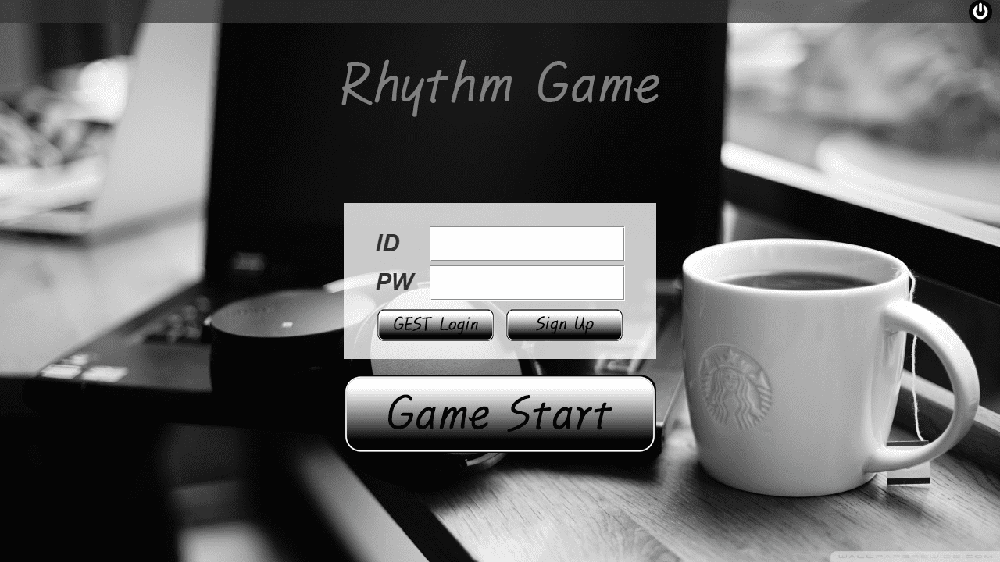
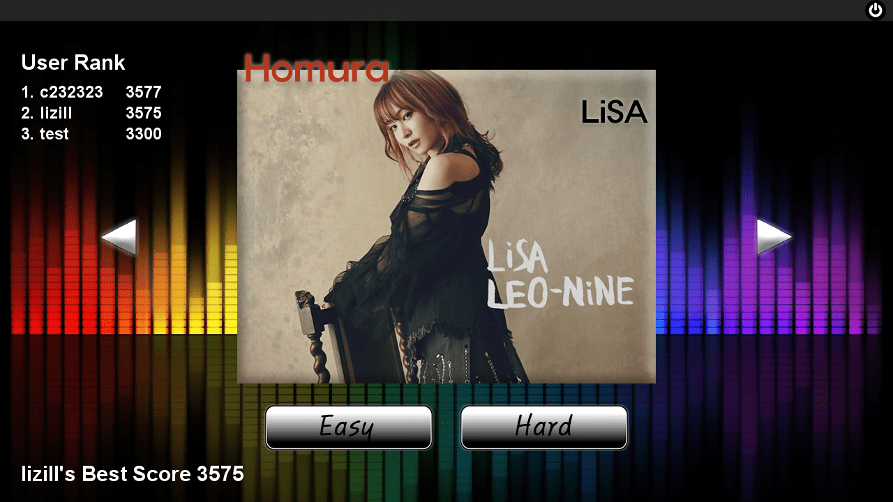
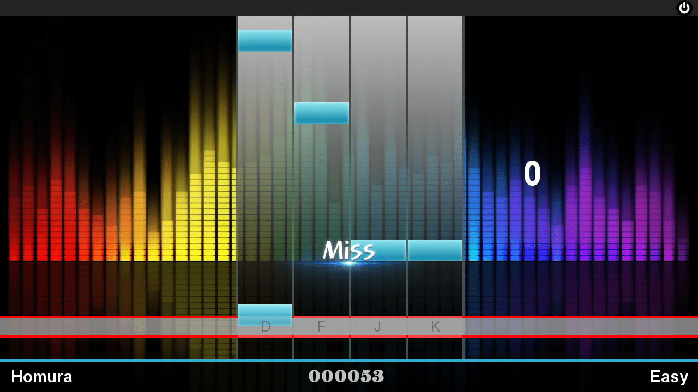
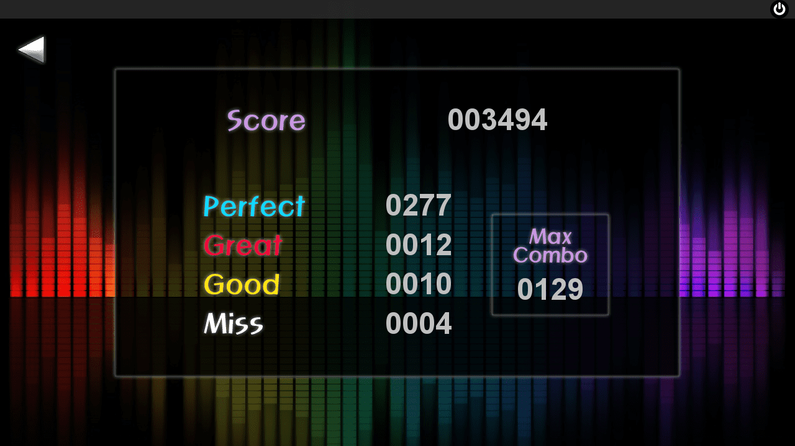

# 자바 리듬게임

> **참고영상**: [동빈나 자바 리듬게임 강좌](https://youtu.be/xs92kqU2YWg?list=PLRx0vPvlEmdDySO3wDqMYGKMVH4Qa4QhR)

자바를 활용해 만든 리듬게임!

# 로그인 화면

> Login

- 게임 실행 시 첫 로그인 화면 입니다.
- 데이터벵스와 연동하여, 회원가입을 하여 로그인 할 수 있도록 구현하였습니다. 절차에 따라 회원가입을 진행해 주세요.
- GEST Login을 통해 서버에 연결 할 수 없는 상황에서도 게임을 플에이 할 수 있습니다.

# 곡 선택화면

> Select Music

- 좌, 우 버튼으로 곡을 선택하고, Easy, Hard 버튼으로 해당 난이도의 게임을 플레이 할 수 있습니다.
- 로그인 시 3등까지의 User Rank를 확인할 수 있습니다. 아이디와 최고 점수가 표시 됩니다.
- GEST Login의 경우 게임을 실행하는 동안 하단의 최고 점수는 표시되나, 랭크에는 반영되지 않습니다.

# 플레이 화면

> Playing Game

- Easy 또는 Hard 버튼 클릭 시 게임이 시작 됩니다.
- Easy 난이도는 4개의 키패드만 사용하고, Hard 난이도는 Space Bar를 추가하여 5개의 키패드를 사용합니다.
- 판정에 따라 Perfect, Great, Good, Miss로 표시 되며, Miss 판정 시 콤보 수가 0으로 돌아갑니다.
- 하단 바에서 곡의 제목과 현재 점수, 난이도를 확인할 수 있습니다.

# 결과 화면

> Result

- 곡 재생이 끝나면 결과 화면이 표시 됩니다.
- 뒤로가기 버튼으로 곡 선택 화면으로 돌아갈 수 있습니다.
